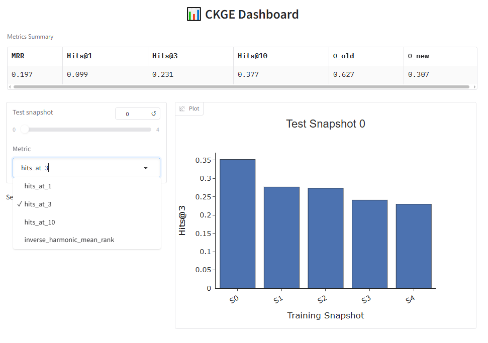

# A FRAMEWORK FOR CONTINUAL KNOWLEDGE GRAPH EMBEDDINGS


This repository provides a **model-agnostic framework** for performing **Continual Knowledge Graph Embedding (CKGE)** directly on top of **PyKEEN**. It allows you to **incrementally update embeddings** when new entities, relations, or triples are introduced. 


---

## ✨ Key Features

| Feature | Description |
|--------|-------------|
| **Model-Agnostic** | Works with *any unimodal KGE model* in PyKEEN (e.g., TransE, DistMult, ComplEx, RotatE, etc.). |
| **Embedding & Model Expansion** | Automatically expands embedding matrices when new KG elements appear. |
| **Informed Initialization** | Supports a schema-based initialization strategy to speed convergence and improve evaluation performance. |
| **Extended Evaluation** | Reports both standard link prediction metrics and CKGE-specific metrics. |
| **Interactive Dashboard** | Visualize performance changes across snapshots, including knowledge acquisition and forgetting. |


## 📁 Repository Structure

```
├── ckge_utils/
│    ├── expand.py              # Model & embedding expansion logic
│    ├── helper.py              # Helper functions to evaluate, create datasets and train
│    ├── train.py               # Continual training loop + dashoard visualization      
├── data/                       # Example incremental KG datasets
├── assets/                     # Figures and dashboard screenshots
└── README.md
```

## 📦 Requirements


Requirements:

* Python ≥ 3.10
* PyTorch (match your CUDA version if using GPU)
* PyKEEN ≥ 1.10
* gradio == 5.49.1
* plotly == 5.24.1

---
## 🧩 Supported Models

Currenlty, the following models are supprted:

| Model Name | Model Name | Model Name | Model Name |
|------------|------------|------------|------------|
| TransE     | TransH     | RotatE     | TransR     |
| DistMult   | HolE       | ProjE      | ComplEx    |
| RESCAL     | TransF     | TuckER     | ConvE      |
| SimplE     | BoxE       | TransD     | TorusE     |
| PairRE     | CP         | MuRE       | QuatE      |
| CrossE     | DistMA     | ConvKB     | KG2E       |
| ERMLP      |            |            |            |
---

## 🚀 Quick Start Example

To easily generate an end-to-end CKGE experiment, you can run the following script:

```python
from ckge_utils import train_CKGE

model, results = train_CKGE(
    model="TransH",                             # Any unimodal KGE model in PyKEEN
    embedding_dim=200,                          # Embedding dimension
    dataset="FBinc-S",                          # Any incremental snapshot dataset
    initialization_args={'method':'random'}     # "random" or "schema"
    epochs_0=100,                               # Base snapshot epochs
    epochs_inc=30,                              # Incremental epochs
    lr_0=1e-3,                                  # Base snapshot learning rate
    lr_inc=1e-4,                                # Incremental learning rate
    dashboarding = True                         # Display dashboard
)
```


---

## 📊 Dashboard Preview

The dashboard displays:

* MRR / Hits@k over snapshots
* Knowledge acquisition metric **Ω_new**
* Catastrophic forgetting metric **Ω_old**
* Interactively monitoring the behavior of the evaluation sets throughout snapshots


---

## 🖥️ Notebook Walkthrough

To showcase the different functionalities of the demo, we provide a [Notebook](https://colab.research.google.com/drive/1QbAyRzh_TF6tSlOZRvv3g41tMK4Z9g3-?usp=sharing) with an accompanying walkthrough video.


---
## 📜 License

MIT License. Feel free to use, modify, and distribute.


